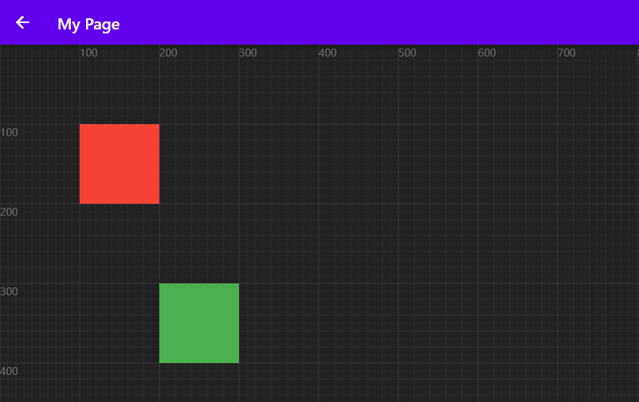

# Basic Usage

Create a Blueprint widget with **children**

## Create your first Blueprint

Add the `Blueprint` to your widget

```dart title="my-page.dart"
import 'package:blueprint_system/blueprint.dart';

...

@override
Widget build(BuildContext context) {
  return Scaffold(
    appBar: AppBar(
      title: const Text("My Page"),
    ),
    // highlight-start
    body: Blueprint(),
    // highlight-end
  );
}
```

Now that we've built the Blueprint, we need to populate it with some nodes so it can function.

## Add nodes

Before we add nodes, we'll write a function that returns a widget that will be used as a child of the nodes; in other words, it'll show how the nodes look.

```dart
Widget nodeChild(Color color) {
  return Container(
    color: color,
  );
}
```

In the Blueprint we built earlier, use the `children` parameter to add a list of nodes like this:

```dart
Blueprint(
// highlight-start
  children: [
    FixedNode(
      child: (c) => nodeChild(Colors.red),
    ),
    DraggableNode(
      initPosition: const Offset(200, 300),
      child: (c) => nodeChild(Colors.green),
    ),
  ]
// highlight-end
),
```

:::note 
Later, we'll go over how nodes work and how to use them in more detail.  
But for the time being, let's concentrate on Blueprint.
:::

## Summary

### Preview


### Full Example
```dart title="my-page.dart"
import 'package:blueprint_system/blueprint_system.dart';
import 'package:flutter/material.dart';

class MyPage extends StatelessWidget {
  const MyPage({Key? key}) : super(key: key);

  @override
  Widget build(BuildContext context) {
    return Scaffold(
      appBar: AppBar(
        title: const Text("My Page"),
      ),
      body: Blueprint(
        children: [
          FixedNode(
            child: (c) => nodeChild(Colors.red),
          ),
          DraggableNode(
            initPosition: const Offset(200, 300),
            child: (c) => nodeChild(Colors.green),
          ),
        ],
      ),
    );
  }

  Widget nodeChild(Color color) {
    return Container(
      color: color,
    );
  }
}
```
